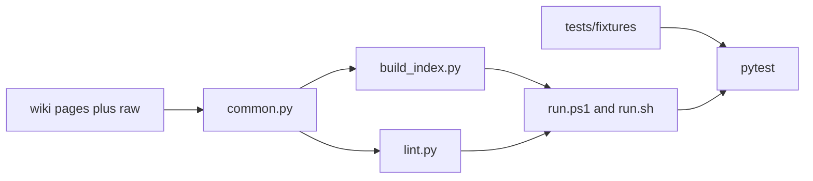

# Agent 2 tooling implementation

Work on branch `agent/2-tooling`, cut from `main` after the Phase 0 commit. The binding spec is [doc/contract.md](c:/Users/ASUS/econ4999b/llm/LLM_wiki/doc/contract.md) sections C1 and C3–C7. Do not edit `wiki/`, `raw/`, `AGENTS.md`, `README.md`, `.cursor/`, `.github/`, `mkdocs.yml`, or [pyproject.toml](c:/Users/ASUS/econ4999b/llm/LLM_wiki/pyproject.toml). PyYAML and pytest are already declared. Do not commit unless asked.

The working tree has the contract and `pyproject.toml` only. Creating `scripts/wiki/` and `tests/` is in scope; those paths are owned by Agent 2.

## 1. Shared parser

Add [scripts/wiki/common.py](c:/Users/ASUS/econ4999b/llm/LLM_wiki/scripts/wiki/common.py) and an empty `__init__.py`. Both scripts import this module; neither redefines the type tables.

- `ALLOWED_TYPES` and `ENTITY_TYPES = {"institution", "person", "country", "indicator", "entity"}`.
- Directory-to-type map from the C1 table: `sources`, `entities`, `concepts`, `topics`, `analyses`.
- Special files, not pages: `index.md`, `log.md`, `overview.md`, `graph.md`.
- `parse_frontmatter`: the file must open with `---`. Parse the YAML block with PyYAML. Missing or unparseable frontmatter is an error, never a default.
- Discover pages by walking `wiki/**/*.md` and skipping special filenames.
- Extract body links, including images, with a regex on `](...)`. Resolve each target against the linking file’s directory. Ignore `http(s)://`. Strip a `#fragment` before the existence check.
- `render_index(pages) -> str` implements C5 so lint and the index script share one renderer.

Index rules to implement inside `render_index`:

- Section order: Topics, Entities, Concepts, Analyses, Sources. Entity subsection order: Institutions, People, Countries, Indicators, Unclassified.
- Omit an empty entity subsection. A top-level section with no pages is the heading, a blank line, and `_None._`.
- Sort entries by `title` with Python’s default string order.
- Entity, concept, topic, and analysis lines end with `(updated YYYY-MM-DD, N sources)` where N is `len(sources)` and the word is always `sources`. Source lines omit the count.
- The link/summary separator is space, U+2014, space. Line endings are `\n`. The string ends with exactly one `\n`. One blank line between consecutive non-blank structural lines.
- Unparseable pages and pages whose `type` is not allowed are left out of the index.

## 2. Clean fixture

Copy the five C2 pages and `raw/speeches/2026-09-20-powell-jackson-hole.md` verbatim into `tests/fixtures/clean/`. Add `wiki/log.md` as the C4 example and `wiki/index.md` as the C5 byte-exact block. Add a short `wiki/overview.md` with no frontmatter. Add `raw/papers/.gitkeep` so the pending-raw check is shown to ignore it. Write every fixture file with `\n` only.

Expected result: lint exit 0, and `build_index.py` reproduces `wiki/index.md` byte for byte.

## 3. Index script

[scripts/wiki/build_index.py](c:/Users/ASUS/econ4999b/llm/LLM_wiki/scripts/wiki/build_index.py):

- `--root` defaults to the current directory. `--check` compares the render to `<root>/wiki/index.md`, prints a unified diff, and exits 1 on any difference.
- Without `--check`, write only `<root>/wiki/index.md` using `newline="\n"`. Never write outside `--root`.

## 4. Lint script

[scripts/wiki/lint.py](c:/Users/ASUS/econ4999b/llm/LLM_wiki/scripts/wiki/lint.py) prints one stdout line per finding, then `lint: <E> errors, <W> warnings`. Any error exits 1. Warnings alone exit 0. Lint writes nothing.

Emit findings in sorted path order, and in C7 table order within a path, so tests can assert an exact set. Stop a file from cascading:

- Missing or unparseable frontmatter: no further frontmatter checks on that file.
- `type` not in `ALLOWED_TYPES`: skip the directory-match check and the type-specific filename check.
- Duplicate slugs: one error per colliding group. Compare slugs after lowercasing and removing `-` and `_`.

Checks, one defect each in `tests/fixtures/broken/`:

- `wiki/concepts/no-frontmatter.md` has no frontmatter.
- `wiki/overview.md` has a frontmatter block and links to every page that must not be an orphan.
- `wiki/concepts/unknown-key.md` adds a key other than the C1 set.
- `wiki/concepts/bad-type.md` uses `type: widget`.
- `wiki/topics/placed-wrong.md` is `type: concept` with a legal concept filename.
- `wiki/concepts/bad-date.md` has `updated` before `created`.
- `wiki/concepts/empty-title.md` has `title: ""`.
- `wiki/concepts/bad-tag.md` has a tag that fails the slug regex.
- `wiki/sources/2026-09-20-powell-missing-raw.md` points `raw:` at a file that is not on disk.
- `wiki/concepts/Bad_Name.md` fails the slug regex.
- `wiki/concepts/neutral-rate.md` and `wiki/concepts/neutralrate.md` are one duplicate group.
- `wiki/concepts/broken-link.md` links to `../entities/missing.md`.
- `wiki/concepts/raw-link.md` links at `../../raw/speeches/2026-09-20-powell-jackson-hole.md`.
- `wiki/index.md` is the rendered index plus one extra line.
- `wiki/log.md` is the C4 example plus one `## ` line that fails the C4 regex.
- `wiki/entities/unclassified-thing.md` is `type: entity` and is linked from overview.
- `wiki/concepts/orphan-page.md` is valid and has no inbound link from a page or from overview. Links from `index.md` and `log.md` do not count, and a self-link does not count.
- `raw/papers/2026-01-01-nobody-unread.md` is cited by no `raw:` key.
- `raw/assets/unused.png` is linked from no page.

Every other page in that fixture is valid and linked from overview, and cites the real speech via a valid source page. Also keep `raw/papers/.gitkeep`, which must not warn.

Add `tests/fixtures/warnings/` with a valid one-source wiki, a correct index, a valid log, plus only the four warning cases: a linked `type: entity` page, an orphan, a pending raw file, and an unreferenced asset. This is the case that proves warnings do not change the exit code. The broken fixture cannot prove it, because its errors force exit 1.

Date checks use `datetime.date.fromisoformat`, so `2026-02-31` fails. Filename conventions: sources match `YYYY-MM-DD-<kebab>.md`, analyses match `YYYY-MM-DD-<slug>.md`, every other page is `<slug>.md`. A body link whose target is missing, or that resolves outside `--root`, is an error. A body link that resolves under `raw/` is an error. External URLs are ignored.

## 5. Tests

[tests/test_build_index.py](c:/Users/ASUS/econ4999b/llm/LLM_wiki/tests/test_build_index.py) and [tests/test_lint.py](c:/Users/ASUS/econ4999b/llm/LLM_wiki/tests/test_lint.py) call the scripts as subprocesses with `--root`.

- Clean: index stdout/file equals the fixture `index.md` bytes; `--check` exits 0; lint exits 0 and reports `lint: 0 errors, 0 warnings`.
- Broken: `--check` exits 1 and the diff mentions the extra line; lint exits 1 and contains exactly one finding per C7 row.
- Warnings: lint exits 0 with exactly four warning lines.
- Direct `render_index` cases the clean fixture does not cover: an empty top-level section renders `_None._`, an empty entity subsection is omitted, and titles sort by code point.

## 6. Wrappers

[run.ps1](c:/Users/ASUS/econ4999b/llm/LLM_wiki/run.ps1) and [run.sh](c:/Users/ASUS/econ4999b/llm/LLM_wiki/run.sh) implement C6 and pass extra arguments through unchanged:

- `index` runs `uv run python scripts/wiki/build_index.py`
- `index --check` runs the same script with `--check`
- `lint` runs `uv run python scripts/wiki/lint.py`
- `serve` runs `uv run mkdocs serve`
- `test` runs `uv run pytest`

If `uv` is missing, print `uv not found` and exit 2. Do not fall back to system Python.

## Done when

From the repo root:

- `./run.ps1 test` is green
- `./run.ps1 lint --root tests/fixtures/clean` exits 0
- `./run.ps1 lint --root tests/fixtures/broken` exits 1 with one line per C7 check
- `./run.ps1 index --check --root tests/fixtures/clean` exits 0
