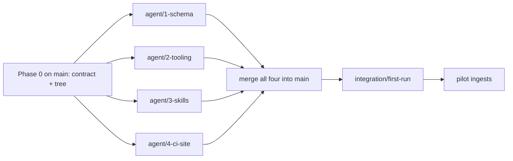

# Team LLM Wiki - Parallel Agents

Derived from [team_llm_wiki_setup_7ed58187.plan.md](team_llm_wiki_setup_7ed58187.plan.md). That plan defines *what* is built; this plan defines *who builds which files, on which branch, in what order*. Design decisions from the parent plan are not repeated here and remain binding.

## Execution model



Rules that make separate devices work:

1. Phase 0 lands on `main` first. Every agent branches from that commit.
2. Phase 0 owns every top-level file and the whole directory tree. Agents only add files inside their owned paths. No agent creates or edits a top-level file or another agent's path.
3. Agents cannot see each other's work. Each agent self-tests against fixtures it writes inside its own path, shaped exactly as `doc/contract.md` specifies.
4. Merge order does not matter. Conflicts are impossible by construction; if one appears, an agent broke rule 2.
5. Cross-component mismatches are fixed in `integration/first-run`, never by reopening an agent branch.
6. Git operations on every branch follow the user rule: propose, wait for `proceed`.

## Phase 0: shared contract (sequential, one agent, on `main`)

Owned files:

```
doc/contract.md
.gitignore
pyproject.toml            # name, python>=3.12, deps: pyyaml, mkdocs-material, pytest; no code
raw/.gitkeep  raw/papers/.gitkeep  raw/reports/.gitkeep  raw/data/.gitkeep
raw/speeches/.gitkeep  raw/notes/.gitkeep  raw/assets/.gitkeep
wiki/.gitkeep  wiki/sources/.gitkeep  wiki/entities/.gitkeep  wiki/concepts/.gitkeep
wiki/topics/.gitkeep  wiki/analyses/.gitkeep
scripts/wiki/.gitkeep  tests/.gitkeep  tests/fixtures/.gitkeep
.cursor/skills/.gitkeep  .github/workflows/.gitkeep
```

`doc/contract.md` must be exact, not descriptive. Required sections:

### C1. Frontmatter spec (literal YAML)

```yaml
---
type: source | institution | person | country | indicator | entity | concept | topic | analysis   # exactly one
title: string
summary: string                                       # one line, <= 200 chars
created: YYYY-MM-DD
updated: YYYY-MM-DD
tags: [kebab-case, ...]                               # may be empty list
sources: [wiki/sources/<slug>.md, ...]                # required for every type except source; absent for source
raw: raw/<category>/<file>                            # required for source only
---
```

No other keys permitted. `lint.py` rejects unknown keys.

Type groups and directories (single source of truth is `ENTITY_TYPES` in `scripts/wiki/common.py`):

| Directory | Allowed `type` values |
|---|---|
| `wiki/sources/` | `source` |
| `wiki/entities/` | `institution`, `person`, `country`, `indicator`, `entity` |
| `wiki/concepts/` | `concept` |
| `wiki/topics/` | `topic` |
| `wiki/analyses/` | `analysis` |

`entity` means "unclassified entity". It is an escape hatch, not a permanent home: lint emits a `warning`, and `AGENTS.md` instructs the LLM to propose a new type when several `entity` pages share a shape. Adding a type requires editing this table, `AGENTS.md`, and `ENTITY_TYPES`.

### C2. One complete example page per type

Five full files in the contract, ready to copy into `tests/fixtures/`. Each has frontmatter, headings as defined by the parent plan's templates, and at least one relative link to another example page so link-checking can be tested. The entity example uses `type: institution`; all entity types share the same template. Naming used by the examples:

```
wiki/sources/2026-09-20-powell-jackson-hole.md
wiki/entities/federal-reserve.md              # type: institution
wiki/concepts/neutral-rate.md
wiki/topics/us-monetary-policy-stance.md
wiki/analyses/2026-09-21-fed-vs-ecb-neutral-rate.md
```

### C3. Link convention

Relative markdown links from the linking file's location: `[Federal Reserve](../entities/federal-reserve.md)`. No `[[wikilinks]]`, no absolute paths, no `.md`-less links.

### C4. Log entry format

```
^## \[\d{4}-\d{2}-\d{2}\] (ingest|query|lint) \| .+$
```

Followed by one or more `- ` bullets, then a blank line. `lint.py` validates every `## ` heading in `wiki/log.md` against this regex.

### C5. Index format (output of `build_index.py`)

```
# Index

_Generated by scripts/wiki/build_index.py. Do not edit._

## Topics
- [Title](topics/slug.md) — summary (updated YYYY-MM-DD, N sources)

## Entities

### Institutions
- [Title](entities/slug.md) — summary (updated YYYY-MM-DD, N sources)

### People
...
### Countries
...
### Indicators
...
### Unclassified
...

## Concepts
...
## Analyses
...
## Sources
- [Title](sources/slug.md) — summary (updated YYYY-MM-DD)
```

Section order fixed as above; entity sub-sections in the order shown, each omitted when empty; entries sorted by title within a (sub-)section. Byte-exact output is what `--check` compares.

### C6. Wrapper interface

```
./run.ps1 index            # uv run scripts/wiki/build_index.py ; exit 0 on success
./run.ps1 index --check    # exit 0 if index up to date, 1 if stale
./run.ps1 lint             # uv run scripts/wiki/lint.py ; exit 0 if clean, 1 if findings
./run.ps1 serve            # uv run mkdocs serve
./run.ps1 test             # uv run pytest
```

`run.sh` identical. Scripts are invoked with repo root as cwd and take no positional arguments other than those above.

### C7. Lint finding format (stdout)

```
<severity>: <relative/path.md>: <message>
```

`severity` is `error` or `warning`. Any `error` yields exit 1. Warnings do not affect exit code. The set of checks and their severities:

| Check | Severity |
|---|---|
| broken relative link | error |
| unknown or missing frontmatter key, bad `type`, bad date | error |
| page directory does not match its `type` group (C1 table) | error |
| duplicate slug (case/separator-insensitive) | error |
| `index.md` stale | error |
| `log.md` heading violates C4 | error |
| `type: entity` (unclassified; propose a specific type) | warning |
| orphan page (no inbound link excluding index.md, log.md) | warning |
| pending raw source (file in `raw/` not referenced by any `raw:` key) | warning |
| `raw/assets/` file not referenced by any page | warning |

### C8. Paths CI will call

`lint.yml` runs exactly `./run.sh lint` and `./run.sh index --check`. `pages.yml` runs exactly `uv run mkdocs build --strict`. `mkdocs.yml` sets `docs_dir: wiki` and `site_dir: site`. Agent 4 relies on these; Agent 2 must make them true.

Acceptance for Phase 0: `doc/contract.md` reviewed by the user; committed and pushed to `main`.

---

## Agent 1: schema and onboarding (`agent/1-schema`)

Owned paths:

```
AGENTS.md
README.md
raw/README.md
wiki/overview.md
wiki/log.md
wiki/index.md                                # hand-written placeholder matching C5 exactly for the seed pages
wiki/sources/2026-09-20-powell-jackson-hole.md
wiki/entities/federal-reserve.md
wiki/concepts/neutral-rate.md
wiki/topics/us-monetary-policy-stance.md
wiki/analyses/2026-09-21-fed-vs-ecb-neutral-rate.md
raw/speeches/2026-09-20-powell-jackson-hole.md   # short real or synthetic source text
```

Inputs: parent plan section "AGENTS.md (schema) contents", `doc/contract.md`, `doc/workflows.md`.

Work:

- `AGENTS.md`: layer rules, page templates (source, entity shared by all entity types, concept, topic, analysis; frontmatter copied from C1), the C1 type-group table, the rule that `type: entity` is a prompt to propose a new type, naming, citation and contradiction conventions, the three workflows as numbered steps referencing `/wiki-ingest`, `/wiki-query`, `/wiki-lint` and `./run.ps1 index|lint` by name, git conventions (branch `wiki/<date>-<slug>`, PR, wait for `proceed`).
- `README.md`: team onboarding, how to add a source, how to review a PR, link to `doc/workflows.md`.
- `raw/README.md`: immutability, naming, categories including `notes/`.
- Seed pages: the five C2 examples, expanded to realistic content, plus the raw file they cite. `log.md` with one `ingest` and one `query` entry matching C4.
- `wiki/index.md`: hand-written in C5 format for the five seeds. Integration will confirm `build_index.py` reproduces it byte-exactly.

Self-test: every relative link in the seed pages resolves (manual or a throwaway script under `scripts/temporary/`, deleted before PR). Every frontmatter block matches C1 by inspection.

Must not touch: anything under `scripts/`, `tests/`, `.cursor/`, `.github/`, `mkdocs.yml`, `run.*`, `pyproject.toml`.

---

## Agent 2: tooling (`agent/2-tooling`)

Owned paths:

```
run.ps1
run.sh
scripts/wiki/__init__.py
scripts/wiki/common.py            # frontmatter parsing, link extraction, page discovery
scripts/wiki/build_index.py
scripts/wiki/lint.py
tests/test_build_index.py
tests/test_lint.py
tests/fixtures/**                 # a mini repo: raw/, wiki/ with the five C2 pages + deliberately broken variants
```

Inputs: `doc/contract.md` sections C1, C3-C7; parent plan section "Tooling".

Work:

- `common.py`: parse frontmatter with `pyyaml`; fail loudly on missing frontmatter (no defaults). Define `ALLOWED_TYPES`, `ENTITY_TYPES = {"institution", "person", "country", "indicator", "entity"}`, and the directory-to-type-group mapping from the C1 table; `build_index.py` and `lint.py` import these rather than redefining them. Extract relative links via regex on `](...)`; resolve against the file's directory.
- `build_index.py`: implements C5 byte-exactly; `--check` compares to `wiki/index.md` and exits 1 on difference, printing a unified diff.
- `lint.py`: implements every row of C7 with the stated severity and the C7 output format. No silent fallbacks: a page that cannot be parsed is an `error`.
- `run.ps1` / `run.sh`: implement C6 exactly. `uv` must be present; do not fall back to system Python.
- Tests: fixtures include one clean mini-wiki (expect lint exit 0, index reproduces fixture `index.md`) and one broken mini-wiki (expect each C7 check to fire once). Scripts accept an optional `--root <path>` so tests can point them at `tests/fixtures/...`; default root is cwd.

Self-test: `./run.ps1 test` green; `./run.ps1 lint --root tests/fixtures/clean` exits 0; `./run.ps1 lint --root tests/fixtures/broken` exits 1 with the expected lines.

Must not touch: `wiki/`, `raw/`, `AGENTS.md`, `README.md`, `.cursor/`, `.github/`, `mkdocs.yml`. `pyproject.toml` deps were fixed in Phase 0; if a new dependency is needed, stop and report rather than editing.

---

## Agent 3: Cursor skills (`agent/3-skills`)

Owned paths:

```
.cursor/skills/wiki-ingest/SKILL.md
.cursor/skills/wiki-query/SKILL.md
.cursor/skills/wiki-lint/SKILL.md
```

Inputs: parent plan section "Cursor skills", `doc/workflows.md` (the three step tables), `doc/contract.md` C1, C3, C4, C6.

Work:

- Each `SKILL.md`: frontmatter (`name`, `description` triggering on `/wiki-ingest` etc.), then the numbered procedure copied from `doc/workflows.md` with the LLM-side steps made imperative and the human checkpoints marked as explicit "stop and wait for `proceed`" points.
- `wiki-ingest`: read order (AGENTS.md, index.md, last 5 log entries, raw text, then images), duplicate check via searching `raw:` keys, checkpoint, write pages using C1 frontmatter, append log per C4, run `./run.ps1 index` then `./run.ps1 lint`, propose branch and commit message, stop.
- `wiki-query`: index-first navigation, citation rule, `--file` branch writing to `wiki/analyses/<date>-<slug>.md` with backlinks, log per C4, index + lint.
- `wiki-lint`: run `./run.ps1 lint`, semantic pass checklist, findings grouped fix/propose/investigate, checkpoint, apply, log per C4.
- Skills reference tools only by the C6 interface and pages only by the C1/C3 conventions. They never restate the schema; they point to `AGENTS.md`.

Self-test: dry-run each skill in Cursor against an empty `wiki/` on the branch, confirming the skill loads, follows the read order, and stops at every checkpoint. No pages need to be produced.

Must not touch: anything outside `.cursor/skills/`.

---

## Agent 4: CI and publishing (`agent/4-ci-site`)

Owned paths:

```
mkdocs.yml
.github/workflows/lint.yml
.github/workflows/pages.yml
doc/hosting.md                    # result of the Pages hosting check
```

Inputs: parent plan section "Publishing", `doc/contract.md` C6, C8.

Work:

- `mkdocs.yml`: Material theme, `docs_dir: wiki`, `site_dir: site`, built-in search, auto nav, `exclude_docs` for `*.json`, `strict: true`. `raw/` is outside `docs_dir` and therefore never published.
- `lint.yml`: `on: pull_request`; checkout, `astral-sh/setup-uv`, `uv sync`, `./run.sh lint`, `./run.sh index --check`.
- `pages.yml`: `on: push: branches: [main]`; checkout, setup-uv, `uv sync`, `uv run mkdocs build --strict`, `actions/upload-pages-artifact`, `actions/deploy-pages`. Permissions `pages: write`, `id-token: write`.
- Hosting check: determine whether `MacroResearchAI/LLM_wiki` is public or the org has GitHub Team (Pages on private repos). Record the finding and, if Pages is unavailable, the recommended alternative in `doc/hosting.md`. Do not enable Pages in repo settings; report and wait.

Self-test: in a temp dir outside the repo, copy `mkdocs.yml`, create `wiki/index.md` with C5 shape and one page from C2, run `uv run mkdocs build --strict`; expect success. Validate both YAML workflow files with `actionlint` if available, otherwise by inspection.

Must not touch: `run.*`, `scripts/`, `wiki/`, `AGENTS.md`, `pyproject.toml`.

---

## Integration (sequential, one agent, `integration/first-run`)

Preconditions: all four agent PRs merged into `main`.

Steps:

1. `uv sync`; `./run.ps1 test` green.
2. `./run.ps1 index --check` against Agent 1's hand-written `wiki/index.md`. Expect exit 0. If not, decide whether the script or the hand-written file deviates from C5 and fix the deviating side.
3. `./run.ps1 lint`. Expect exit 0 on the seed pages. Fix findings in the seed pages if the pages are wrong, in `lint.py` if the check is wrong relative to C7.
4. `./run.ps1 serve`; open the site; check nav, search, links.
5. In Cursor, run `/wiki-query "What does the wiki say about the neutral rate?"` against the seed pages; confirm citations resolve.
6. Push the branch, open a PR, confirm `lint.yml` goes green. Merge, confirm `pages.yml` deploys (if hosting permits).
7. Record any contract amendments in `doc/contract.md` and mirror them in `AGENTS.md`.

Acceptance: green CI on `main`, deployed site, `./run.ps1 lint` exit 0.

## Pilot (sequential, with the user)

Ingest 2-3 real macro sources one at a time via `/wiki-ingest` on `wiki/<date>-<slug>` branches through PR. After each, note what the skill or schema got wrong and amend `AGENTS.md` and `SKILL.md` in the same PR. Deferred items (graph page, search CLI, Marp/matplotlib conventions) remain in the parent plan's phase 5.

## Branch and merge summary

| Branch | Base | Owner | Merges into |
|---|---|---|---|
| `main` (Phase 0 commit) | – | one agent | – |
| `agent/1-schema` | Phase 0 commit | Agent 1 | `main` via PR |
| `agent/2-tooling` | Phase 0 commit | Agent 2 | `main` via PR |
| `agent/3-skills` | Phase 0 commit | Agent 3 | `main` via PR |
| `agent/4-ci-site` | Phase 0 commit | Agent 4 | `main` via PR |
| `integration/first-run` | `main` after all four merged | one agent | `main` via PR |
| `wiki/<date>-<slug>` | `main` | ingest sessions | `main` via PR |

Note: `lint.yml` does not exist until Agent 4 merges, so the four agent PRs are reviewed without CI. Their self-tests substitute for it.
