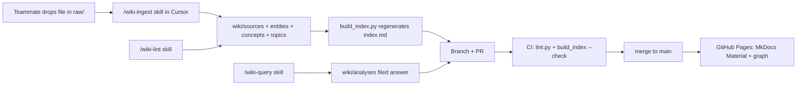

# Team LLM Wiki Setup (Cursor + Git + MkDocs)

## Design decisions

- **Three layers, as in the gist**: `raw/` (immutable sources), `wiki/` (LLM-owned markdown), `AGENTS.md` (the schema). Cursor reads `AGENTS.md` natively, and it stays portable to Codex/Claude Code for teammates using other agents.
- **Standard relative markdown links, not `[[wikilinks]]`**, so pages render on GitHub, in Cursor preview, and in MkDocs without plugins.
- **`index.md` is generated, not hand-maintained.** Every page carries YAML frontmatter (`type`, `title`, `summary`, `created`, `updated`, `sources`, `tags`); `build_index.py` regenerates `wiki/index.md` from it. This removes the #1 merge hotspot for a team and enforces consistency (per the "formatting must be enforced" lesson in the gist thread). CI fails if the index is stale.
- **`log.md` stays append-only, LLM-written**, with the strict prefix `## [YYYY-MM-DD] ingest|query|lint | Title` so it is greppable. Merge conflicts there are always "keep both".
- **"Pending ingest" is computed**: a file in `raw/` with no `wiki/sources/*` page citing it is pending. Lint reports it; no flags to drift.
- **Review via PR**: each ingest/query session works on a branch `wiki/<date>-<slug>`; CI runs lint; a human merges. Cursor never runs `git add/commit/push` without your approval (matches your rules).
- **Browsing**: MkDocs Material with `docs_dir: wiki`, deployed to GitHub Pages on merge to `main`. `raw/` is never published (copyright). A generated interactive link graph page substitutes for Obsidian's graph view.



## Repository layout (files to create)

```
AGENTS.md                     # the schema: structure, conventions, workflows
README.md                     # human onboarding: how to add sources, run skills, review PRs
.gitignore
pyproject.toml                # uv project; deps: pyyaml, mkdocs-material
run.ps1 / run.sh              # wrappers: index | lint | serve | graph
doc/
  workflows.md                # human-facing ingest / query / lint procedures + glossary (DONE)
raw/
  README.md                   # rules: immutable, naming <yyyy-mm-dd>-<slug>.<ext>
  papers/  reports/  data/  speeches/  assets/
wiki/
  index.md                    # GENERATED
  log.md                      # append-only
  overview.md                 # evolving synthesis / house view
  sources/                    # one page per raw source
  entities/                   # institutions, people, countries, indicators
  concepts/                   # r-star, term premium, Phillips curve, ...
  topics/                     # synthesis pages with evolving theses + open contradictions
  analyses/                   # filed query answers (comparisons, charts, notes)
  graph.md                    # GENERATED graph page (phase 4)
scripts/wiki/
  build_index.py              # frontmatter -> index.md; --check mode for CI
  lint.py                     # broken links, orphans, missing frontmatter, pending raw, stale index, log format, duplicate slugs
  graph.py                    # link graph -> wiki/graph.json + graph.md (phase 4)
.cursor/skills/
  wiki-ingest/SKILL.md        # /wiki-ingest <raw path>
  wiki-query/SKILL.md         # /wiki-query <question> [--file]
  wiki-lint/SKILL.md          # /wiki-lint
mkdocs.yml                    # docs_dir: wiki, Material theme, search, exclude graph.json from nav
.github/workflows/
  lint.yml                    # PR: uv run scripts/wiki/lint.py && build_index.py --check
  pages.yml                   # main: mkdocs build + deploy to Pages
```

## AGENTS.md (schema) contents

- Layer rules: never modify `raw/`; only write under `wiki/`; never edit `index.md` by hand (run `build_index`).
- Page types and templates for macro research:
  - `source`: bibliographic metadata, raw path, key claims (each linked to the entity/concept/topic page it touched), data/figures referenced, "pages updated" list.
  - `entity` (institution, person, country, indicator), `concept`, `topic` (thesis, supporting/contradicting evidence with source citations, open questions), `analysis` (question, answer, sources consulted, date).
- Frontmatter spec (required keys, allowed `type` values, ISO dates, `sources:` as list of `wiki/sources/...` paths).
- Naming: kebab-case slugs; entities singular; sources `yyyy-mm-dd-<author>-<slug>.md`.
- Citation convention: every factual claim in a topic/entity page links to a source page; superseded claims are struck through with a note, not silently deleted.
- Workflows (ingest / query / lint) as numbered steps, including the branch + PR step and the `run lint` + `run index` gate before proposing a commit.
- Contradiction handling: record in the topic page under "Disagreements", never resolve by deletion.

## Cursor skills

- `/wiki-ingest`: read raw file (text first, then referenced images in `raw/assets/`), discuss takeaways, write source page, update/create entity/concept/topic pages, append log entry, run `run index` + `run lint`, propose branch name and commit message (await approval).
- `/wiki-query`: read `index.md` first, drill into pages, answer with citations; if `--file`, write to `wiki/analyses/` and log it.
- `/wiki-lint`: run `lint.py`, then do the semantic pass the script cannot (contradictions, stale claims, missing concept pages), file fixes, log it.

## Tooling (Python, uv)

- `lint.py` checks: broken relative links; orphan pages (no inbound links, excluding index/log); frontmatter required keys and allowed values; pending raw sources; `index.md` stale vs frontmatter; `log.md` entry prefix format; duplicate slugs (case/separator-insensitive). Exit non-zero on any finding; no silent fallbacks.
- `build_index.py`: groups pages by `type`, lists `[title](path) — summary (updated, n sources)`.
- `graph.py` (phase 4): emits `graph.json` and an HTML/JS force-graph page rendered inside MkDocs.

## Publishing

- MkDocs Material, `docs_dir: wiki`, auto nav, built-in search (covers the "search engine" need at moderate scale; qmd/BM25 can be added later).
- `pages.yml` deploys on push to `main`. Assumption: repo stays public, or the org has GitHub Team so Pages works on a private repo. If neither, alternative hosting is needed; flag before phase 3.

## Phases

1. Scaffold: layout, `AGENTS.md`, `README.md`, `pyproject.toml`, wrappers, `.gitignore`.
2. Skills + scripts: three `SKILL.md` files, `build_index.py`, `lint.py`; verify on 2 seed pages.
3. CI + site: `lint.yml`, `pages.yml`, `mkdocs.yml`; first deploy.
4. Pilot: ingest 2-3 real macro sources one at a time with you, refine `AGENTS.md` from what breaks.
5. Later, as needed: `graph.py`, search CLI (qmd or simple BM25), Marp/matplotlib output conventions.

Git operations (branch, commit, push) will be proposed at each phase and executed only on your explicit approval.